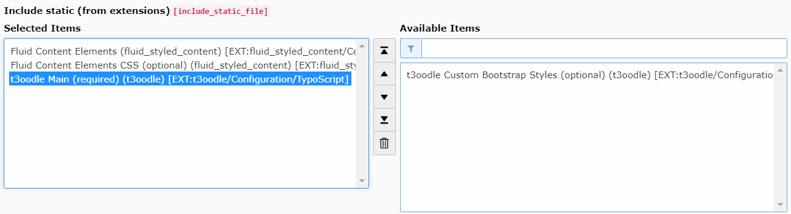

.. include:: ../Includes.txt

.. _installation:

Installation
============

You can install t3oodle with or without Composer. It's recommended to use composer.

With Composer
-------------

Just perform the following command on CLI:

::

    $ composer req fgtclb/t3oodle

When composer is done, you need to enable the extension in the extension manager.

Without Composer
----------------

You can also fetch t3oodle from TER and install it the old-fashioned way.

Extension settings
------------------

t3oodle does not provide any extensions settings. Configuration is made in TypoScript setup.

TypoScript settings
-------------------

Make sure to include the TypoScript **t3oodle Main (required)** to your template.

In :ref:`configuration` chapter, you see all TypoScript settings and its defaults.

Because t3oodle is based on **Bootstrap CSS framework**, there is an optional TypoScript for this:
**t3oodle Custom Bootstrap Styles (optional)**

.. note::
   All javascripts included in frontend are written in vanilla JS and run in parallel
   with any other framework (like Vue.js).
