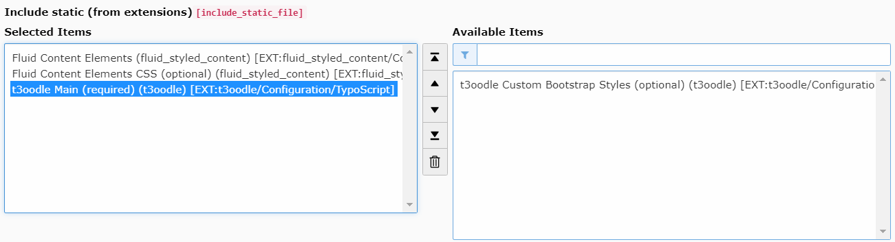

.. include:: ../Includes.txt

.. _installation:

Installation
============

You can install t3oodle with or without Composer. It's recommended to use composer.

With Composer
-------------

Just perform the following command on CLI:

::

    $ composer req 'fgtclb/t3oodle':'^2.0@dev'

When composer is done, you need to enable the extension in the extension manager.

Without Composer
----------------

You can also fetch t3oodle from TER and install it the old-fashioned way.

.. _installation-updating:

Updating
--------

TYPO3 compiles its dependency injection container once and caches it, by
default in :file:`typo3temp/var/cache/code/di/`. A release of t3oodle may change the
dependencies of its classes, so the container has to be rebuilt after an update.

With Composer this happens on its own: the cache identifier of the container is
derived from :file:`composer.lock`, so installing another release changes it.

Without Composer it does not. The identifier is derived from the TYPO3 version
and the modification time of :file:`typo3conf/PackageStates.php`, and replacing
the files of an extension that is already active, by upload, FTP or the
Extension Manager, changes neither. The "Flush all caches" button of the backend
toolbar removes the container only in the Development context.

.. important::
   After every update of t3oodle in a non-composer installation, flush the
   container in :guilabel:`Admin Tools > Maintenance > Flush TYPO3 and PHP Cache`.
   This also resets the PHP opcache of the web server. On the command line,
   :bash:`typo3/sysext/core/bin/typo3 cache:flush` run from the document root
   removes the container as well.

   Otherwise the frontend can fail with an error like
   ``Too few arguments to function FGTCLB\T3oodle\Service\UserService::__construct()``
   (`#47 <https://github.com/fgtclb/t3oodle/issues/47>`__), raised from a
   cached container that was compiled for the previous release.

Extension settings
------------------

t3oodle does not provide any extensions settings. Configuration is made in TypoScript setup.

TypoScript settings
-------------------

Make sure to include the TypoScript **t3oodle Main (required)** to your template.

In :ref:`configuration` chapter, you see all TypoScript settings and its defaults.

Because t3oodle is based on **Bootstrap CSS framework v4**, there is an optional TypoScript for this:
**t3oodle Custom Bootstrap Styles (optional)**

.. note::
   All javascripts included in frontend are written in vanilla JS and run in parallel
   with any other framework (like Vue.js).
