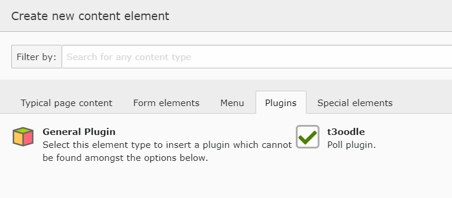
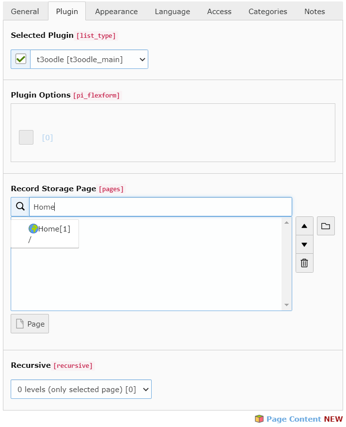
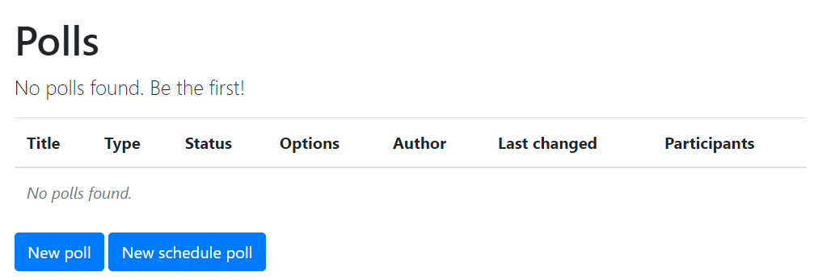

.. include:: ../Includes.txt

.. _usageAddingPlugin:

Adding t3oodle plugin
---------------------

When t3oodle is successfully installed, you just need to place a plugin on any page you want:

In plugin settings of t3oodle you need to define where to store new polls and votings.
If it is empty, they are stored on pid=0 (root).

**Now, in fronend you should get this output:**

