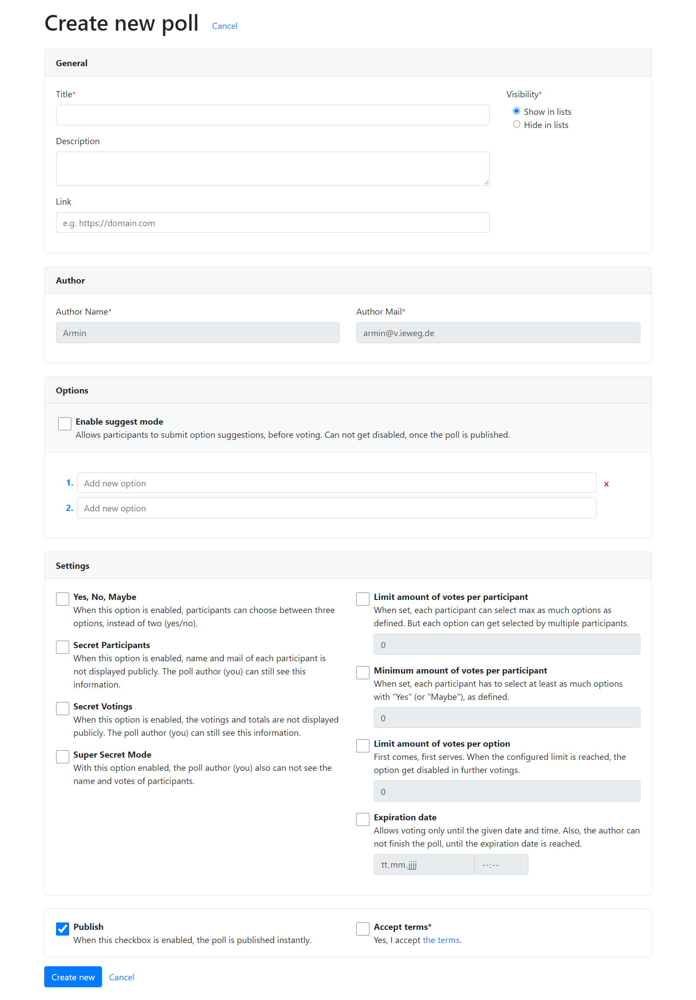

.. include:: ../Includes.txt

.. _usageCreatingNewPolls:

Creating new polls
------------------

There are two types of polls:

- simple and
- scheduled

Both are absolute identically, the only difference is the **new action**, which provides a date picker
for scheduled polls.

General
~~~~~~~

Here you can define general information about the poll. A **title**, a **description** and a "more info" **link**.

In show action of a single poll, it looks like this:

The **visibility** controls if the poll is shown in list action or not. The author of the poll, still can see his/her
own poll.

Also, when visibility is set to "Hide in lists", the slug generated for this poll, is not based on the entered title
anymore.

Author
~~~~~~

Here, every visitor of your website can enter his/her name and mail address. Both are mandatory fields.

.. important::
   Each visitor which creates a new poll or votes for an exiting poll, get a cookie (``tx_t3oodle_userIdent``) set.
   Cookie lifetime is set to **365 days**.

The cookie is only used, to identify an author of a poll and participants, which voted for a poll.

.. note::
   When an author deletes cookies, admin access to poll is impossible. When participants delete the cookie, they can
   vote several times on same poll.

Alternatively, you can disable creation of new polls and voting for polls, using TypoScript.
Then, only logged in frontend users (fe_users) can interact with t3oodle.
Guests (non-logged in visitors) can still see the polls.

Once the user has entered name and mail address, it get stored in **local storage**.

.. note::
   When userIdent cookie is set, the name and mail input fields are disabled!

Options
~~~~~~~

Here you can define the options for your poll.

+----------------------------------------------------------+---------------------------------------------------------+
| Simple poll                                              | Scheduled poll                                          |
+==========================================================+=========================================================+
| .. image:: Images/new-options-simple-poll.png            | .. image:: Images/new-options-scheduled-poll.png        |
|    :alt: Add new options to a simple poll                |    :alt: Add new options to a scheduled poll            |
|    :width: 99%                                           |    :width: 99%                                          |
+----------------------------------------------------------+---------------------------------------------------------+

The date picker for scheduled polls only appear in new action. The text format which is being saved is:

::

    2020-12-24 - 16:00-18:00

When you keep this syntax, t3oodle is able to treat the text content as DateTime, which is very useful for further
features like ICS export (for e.g. Outlook support).

The time is optional. You can also use any text here.

.. tip::
   There is not limit of options you can add, but at some point it doesn't make fun anymore to vote for the poll.

Settings
~~~~~~~~

Every poll have various settings, the poll author can change:

.. _yesNoMaybe:

Yes, No, Maybe
""""""""""""""
.. container:: table-row

   Description
      When this option is enabled, participants can choose between three options, instead of two (yes/no).

      .. image:: Images/setting-yes-no-maybe.png
        :alt: "Maybe" option state
        :height: 150px
        :class: with-border

.. _secretParticipants:

Secret Participants
"""""""""""""""""""
.. container:: table-row

   Description
      When this option is enabled, name and mail of each participant is not displayed.

      .. caution::
         The poll author and system administrators can see the hidden information.

.. _secretVotings:

Secret Votings
""""""""""""""
.. container:: table-row

   Description
      When this option is enabled, the votings and totals are not displayed.

      .. caution::
         The poll author and system administrators can see the hidden information.

.. _superSecretMode:

Super Secret Mode
"""""""""""""""""
.. container:: table-row

   Description
      When this option is enabled, the options **Secret Participants** and **Secret Votings** are also enabled.
      Additionally, nobody (not even the poll author or admins) can see participant names and votings. Also,
      in TYPO3 backend, the votes get hidden when this setting is enabled.

.. _oneOptionOnly:

One option only
"""""""""""""""
.. container:: table-row

   Description
      Each participant can only select one option. But one option can get selected by multiple participants.

.. _limitAmountOfVotesPerOption:

Limit amount of votes per option
""""""""""""""""""""""""""""""""
.. container:: table-row

   Description
      First comes, first serves. When the configured limit is reached, the option get disabled in further votings.

.. _expirationDate:

Expiration date
"""""""""""""""
.. container:: table-row

   Description
      Allows votings only until the given date and time.
      Also, the author can not finish the poll, until the expiration date is reached.

Publish
~~~~~~~

By default a poll is directly published. You can uncheck this box, then the poll is created but not publicly available.
You can make changes, before publishing the poll.

Accept terms
~~~~~~~~~~~~

By default this option is disabled. You can enable it in TypoScript and define a page, external URL or file to display
when clicking the link.

When this option is enabled, the author of a new poll needs to accept the linked terms, before the poll is created.

