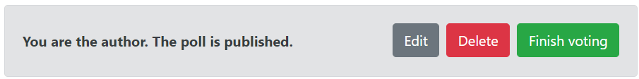
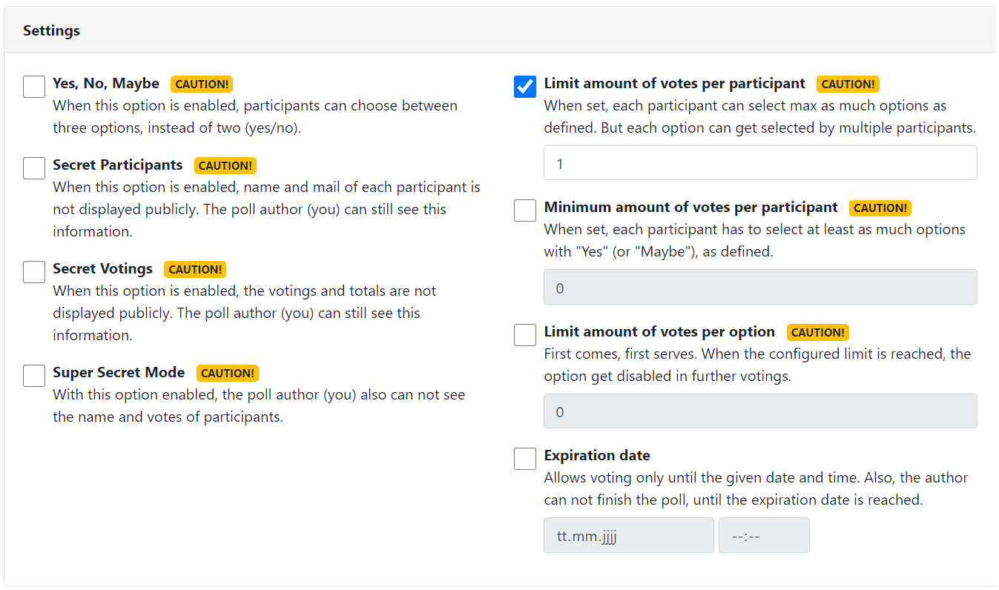

.. include:: ../Includes.txt

.. _usagePollAdministration:

Poll administration
-------------------

As author of a poll (or administrator) you can edit or finish the poll and you can reset all existing votes.

Below the voting table, authors see an additional box:

Here you can edit, delete or finish the poll (voting process).

.. note::
   Once the first participant placed its vote, the poll can not get deleted anymore.

Instead you can reset all existing votes, until the poll status is "closed":

Editing published polls
~~~~~~~~~~~~~~~~~~~~~~~

When you've already published a poll and edit its options or change an option related setting (like :ref:`yesNoMaybe`),
all existing votes get removed!

The affected settings and the options section got a "Caution!" label set.

Finish voting
~~~~~~~~~~~~~

The poll author can finish a poll anytime he/she want, after the poll has been published, **unless** an expiration date
has been set, in settings of the poll. Then, the finish action can only get triggered, when the expiration date is
reached.

When finishing the poll, you need to select a final option.

Once a poll has been finished, the show action displays the final option, selected by poll author.

