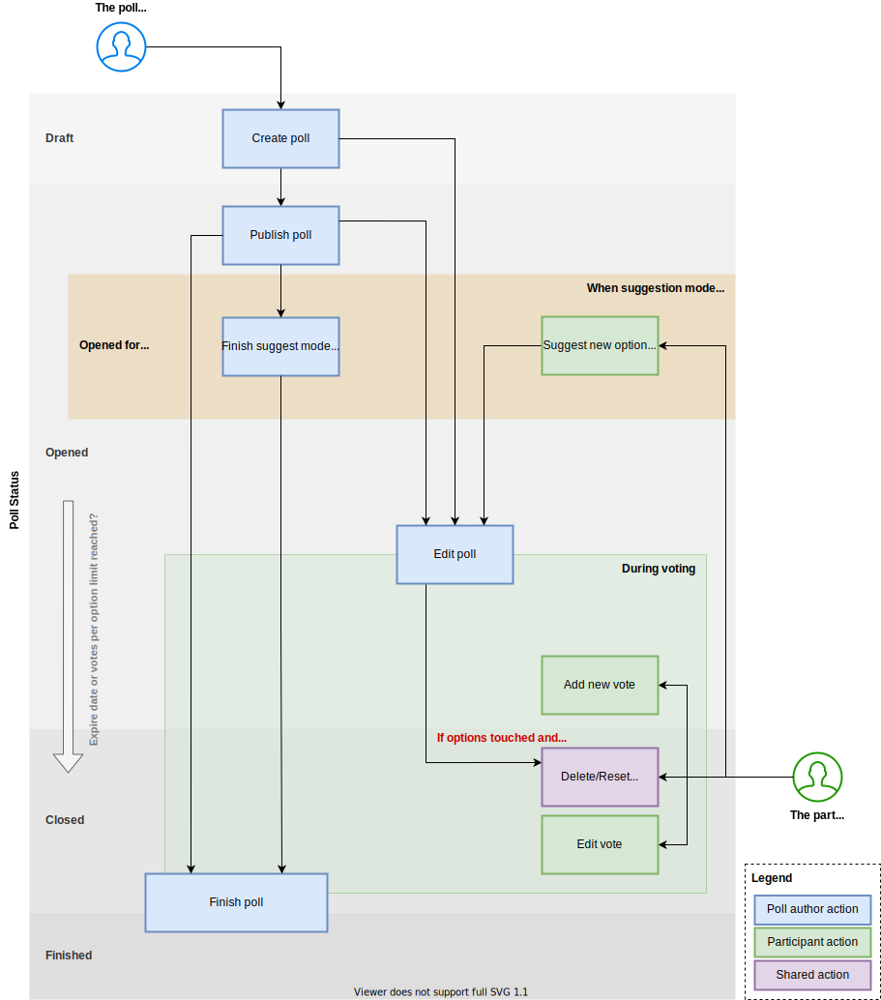

.. include:: ../Includes.txt

.. _usagePollLifecycle:

Lifecycle of polls
------------------

   Lifecycle of polls in t3oodle

1. Poll author creates poll
===========================

The first step in lifecycle of a poll is the form which allows frontend users to create new polls.
Here the user can decide to publish the poll directly or keep it as :ref:`draft <pollStatusDraft>`.

When the user does not publish the poll, s/he (as poll author) and administrators only see the poll in list action:

2. Publishing the poll
======================

Once the poll author is satisfied with his inputs, s/he can publish the poll. Then it becomes public and participants
can vote for it.

If a poll appears in list view is also depending on the visibility setting, each poll has.

When visibility set to **hide in list** the poll will **not** get displayed in list action, even when published.
Same as for draft polls, only the poll author and administrators can see the poll in list.

.. note::
   When poll visibility set to **hide in list** also the slug (used in URL) is **not** based on the entered poll title
   anymore. The slug is **generated randomly** then.

.. caution::
   Currently there is no invite mechanism existing. You need to send the link to participants manually.

The publish date is recorded in poll record.

3a. Open for suggestions
========================

During this phase, the participants can submit own option suggestions.

When the poll author finished the suggestion mode or the mode has not been enabled, the voting begins.

3b. Voting for the poll
======================

Once a poll is published, participants can see poll details and vote for it.

During the poll (status) is :ref:`opened <pollStatusOpened>` or :ref:`closed <pollStatusClosed>`, participants can
**edit** or **delete** their own vote.

Also, the poll author is able to reset all votes from poll. And votes get deleted, when the poll author makes changes
to options or option related settings.

4. Editing the poll
===================

Poll authors and administrators **can edit** their poll **all the time**, **until** the **poll is finished**.

When editing the poll **after it has been published**, you should know two things about:

1. When you **update options** or **option related settings**, all **existing votes** for this poll **are getting removed**!
   In edit form you get reminders for that.
2. When you **change the visibility** setting of the poll **or its title**, the **slug gets updated**!
   Then, you need to **send the updated link** to your participants manually.

.. note::
   Polls with exiting votes and finished polls can not get deleted.

5. Finishing the poll
=====================

The poll author can finish the poll at any time, unless the poll's expiration date is set.
S/he have to select a final option for that.

When a poll is :ref:`finished <pollStatusOpened>`:

- Poll becomes sticky (not editable nor deletable (even without existing votes))
- No new votings possible
- Existing votes are sticky

The finish date and final option is recorded in poll record.
