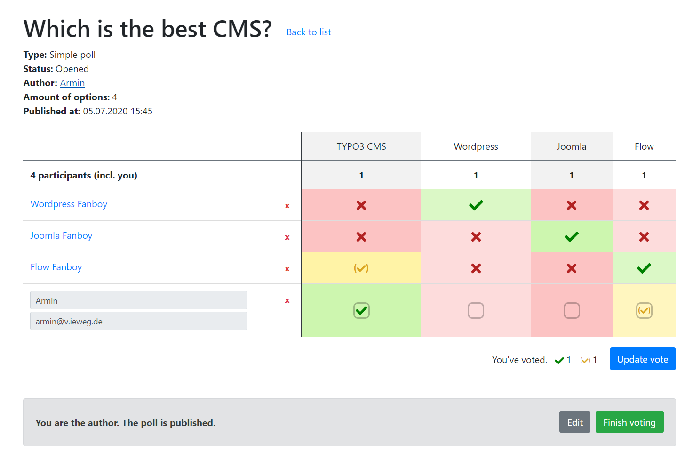

.. include:: ../Includes.txt

.. _welcome:

Welcome
=======

**t3oodle** is a simple poll extension for **TYPO3 CMS**, which allows your frontend users to create polls

   Show action of a single poll, shown as author of the poll.

Features
--------

- Create and edit polls (and its options) in frontend
    - Two types are available: **simple options** and **schedule** (with date picker)
    - Each poll has various settings, like
        - Third option state (yes/no/maybe)
        - Expire date
        - Secret votings and/or participants or
        - Limit amount of votes per option
- Vote on existing polls
- Accessible for logged in frontend users and guests (configurable)
    - guests get a "userIdentifier" stored as cookie, when they create a poll or vote for it!
- Poll author can finish voting and select a final option
- Highly configurable (via TypoScript)
- Easy to extend, thanks to helpful signals and well structured templates
- Provided JavaScript functionality
    - is written in pure (vanilla) JS
    - ships and uses the date picker "flatpickr" (as only dependency)
    - runs in parallel with other JS frameworks, like Vue.js
- TYPO3 9 LTS and 10 LTS compatibility
- Complete documentation
